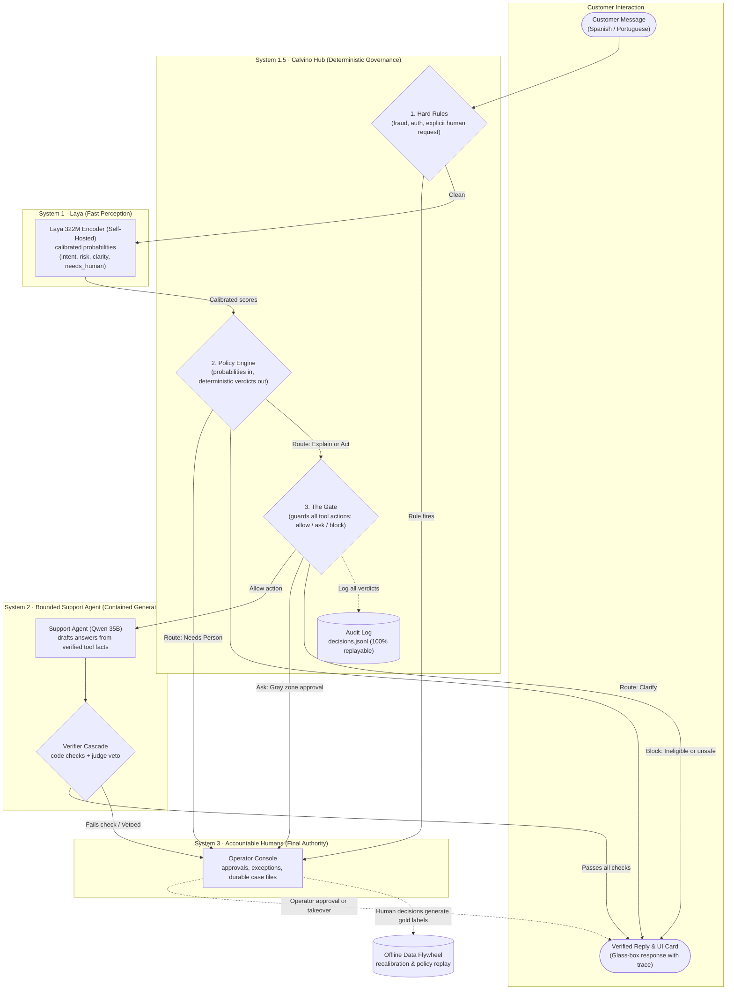

# Project Calvino


**An evolutionary, AI-powered decision engine for banking customer service: it answers payment questions safely, takes an action only when the policy allows it, and hands investigations to people with a complete file.**

Models suggest, a versioned policy decides, people approve what matters, and their decisions improve the next version. Built for the [Factored AI & Data Hackathon 2026](https://www.factored.ai/careers/ai-data-hackathon). Full rationale and architecture: [DESIGN.md](docs/DESIGN.md).

---

## Why Calvino?

Standard LLM customer-service agents present unacceptable risks in regulated banking: models hallucinate account facts, execute non-deterministic tool calls, succumb to prompt injection, and cannot provide an auditable decision trail.

Calvino replaces the unconstrained agent with a **governed 4-tier cognitive hierarchy**:

* **System 1 (Laya — Fast Perception)**: A self-hosted, open-weight 322M multilingual encoder (`laya-multilingual`, Apache 2.0). Runs on CPU in sub-second time without sampling. Returns calibrated probability vectors for intent, risk, clarity, and human need. Customer text never leaves the bank for decisions, and the model never writes prose.
* **System 1.5 (Calvino Hub — Deterministic Governance)**: The bridge. Enforces the rule: **"Probabilities in, deterministic verdicts out."** Hard rules (fraud indicators, authentication failures, explicit human requests) evaluate first and always win. Versioned policies ([`policy/v1.yaml`](policy/v1.yaml), [`policy/v2.yaml`](policy/v2.yaml)) determine routing. The Gate intercepts every tool write (`allow`, `ask` a person, or `block`). Missing inputs fail closed. Every verdict is written to `decisions.jsonl` with 100% replayability.
* **System 2 (Bounded Support Agent — Contained Language)**: Open LLM (Qwen 3.6-35B on Hetzner) strictly restricted to drafting explanations from verified tool facts. The agent has no authorization to act on its own. All drafted text passes through the financial verifier cascade (`customer-answer@2`: deterministic code checks and judge veto) before reaching the customer.
* **System 3 (Humans — Accountable Authority)**: Human operators approve gray-zone actions (`interrupt()`), manage durable case files, and resolve edge cases. Human decisions generate gold labels for the offline data flywheel.

**Gold-label review status `[measured]`:** the first 50 classifier-label rows include 18 maintainer-only labels and 32 model-drafted proposal rows that require explicit maintainer review. The proposals were drafted with Claude Sonnet 5.5 (`claude-sonnet-5-5`) in Claude Code on 2026-10-05. The maintainer saw the proposals before review, which creates anchoring risk and reduces label independence; do not describe the resulting labels as blind or independent human annotations. Only values the maintainer explicitly accepts or corrects become gold labels. Oracle facts and human outcomes for these 50 rows were drafted by `mimo-v2.6-flash-free` (OpenCode) on 2026-10-05 and are maintainer-reviewed (decision 48); they are not blind or independent human annotations, and the agreement figure is that drafter's consistency with the hand-written TSD-013 table, not independent maintainer consistency.

---

## The Workflow: Stuck Payments

Calvino focuses on the highest-volume, highest-impact customer journey: **stuck payments, end to end** (decision 17).

| Stage | What the Customer Receives | Governance Mechanism |
|---|---|---|
| **Explain** | Clear status of a declined, pending, or reversed payment from bank records | Read-only tool access; verified grounding |
| **Clarify** | One targeted clarifying question or a structured payment picker | Activated when request clarity is below policy threshold; nothing runs on a guess |
| **Act** | Cancelled or retried transfer (simulated ISO 20022 action) | Gated write: single-use confirmation token, ownership check, eligibility verification |
| **Investigate** | Case reference number and timeline | Durable case file opened for human operator handoff |
| **Follow-up** | Verified status update on an existing case | Re-authenticates case ownership and reads immutable audit timeline |

Disputes and fraud signals always escalate to a person, and Calvino never moves money on its own. Detailed walkthrough: [DESIGN.md §6.2](docs/DESIGN.md#62-one-journey-end-to-end).



---

## Banking Core Boundary: ISO 20022 Contracts

Calvino decouples the governance hub from any specific core banking database by wrapping all financial data and operations in **ISO 20022-aligned message contracts** exposed via the Model Context Protocol (MCP):

| Domain | ISO 20022 Standard | Contract Schema (`contracts/tools/`) | Exposed Semantics |
|---|---|---|---|
| **Account Statements** | `camt.053` / `camt.054` | [`account-entry.schema.json`](contracts/tools/account-entry.schema.json) | Booking/value dates, ISO 4217 currency, entry reference, credit/debit indicators, remittance text |
| **Payment Status** | `pacs.002` | [`payment-status.schema.json`](contracts/tools/payment-status.schema.json) | Original payment reference, transaction status (`Pending`, `Declined`, `Reversed`), and reason codes |
| **Cancellations** | `camt.056` $\rightarrow$ `camt.029` | [`cancellation-response.schema.json`](contracts/tools/cancellation-response.schema.json) | Pending transfer cancellation requests and resolutions with single-use confirmation tokens |
| **Investigations** | `camt.027` / `camt.029` | [`investigation.schema.json`](contracts/tools/investigation.schema.json) | Claim non-receipt and dispute dossiers handed to human operators |

Every tool schema is strictly validated under [`contracts/tools/`](contracts/tools/), and all monetary operations enforce ISO 4217 (currencies: USD, MXN, COP, ARS), ISO 3166 (country codes: MX, CO, AR), and ISO 18245 (merchant category codes).

---

## Quick Start

### Prerequisites
* Python 3.11+
* [uv](https://docs.astral.sh/uv/)
* Node.js 18+ (for frontend)

```bash
# 1. Clone the repository and configure git hooks
git clone https://github.com/moebious/factored-hackathon-2026-calvino.git
cd factored-hackathon-2026-calvino
git config core.hooksPath .githooks

# 2. Sync dependencies and run the offline test suite
uv sync
uv run pytest

# 3. Validate synthetic data contracts
uv run python scripts/validate_data_contracts.py --dir tests/fixtures/lakehouse
```

> **Note on Tests:** All unit and integration tests run entirely offline with no network calls, GPUs, or external dataset credentials required.

---

## Running the Demo

Calvino provides a glass-box web interface (`frontend/`) and a demo API (`calvino.api`) preloading Laya on CPU:

```bash
# Terminal 1: Launch the demo API on :7860
CALVINO_CONFIRMATION_KEY=test-secret-key-must-be-at-least-32-bytes uv run python -m calvino.api

# Terminal 2: Launch the Next.js customer application on :3000
cd frontend && npm install && BACKEND_URL=http://127.0.0.1:7860 npm run dev

# Alternatively, run the containerized service:
docker build -t calvino-demo:local .
docker run -p 7860:7860 -e CALVINO_CONFIRMATION_KEY=test-secret-key-must-be-at-least-32-bytes -v calvino-data:/data calvino-demo:local
```

### One Real Turn, Captured

What the system produces on a single turn (persona `ana`, routine Spanish status request):

```bash
curl -s -H 'content-type: application/json' \
     -d '{"persona":"ana","text":"Mi pago E-MX-002 sigue pendiente, ¿qué pasa?"}' \
     http://127.0.0.1:7860/api/hub/message
```

Response payload:

```json
{
  "reply": "¿Sobre cuál de tus pagos quieres consultar? Dime el monto, la fecha o el destinatario y lo reviso.",
  "card": {
    "key": "problem_transactions",
    "payload": {
      "entries": [
        {
          "entry_reference": "E-MX-002",
          "amount": "5000.00",
          "currency": "MXN",
          "status": "Pending",
          "booking_date": "2026-06-10",
          "remittance_information": "Transfer to a friend",
          "country": "MX"
        }
      ]
    }
  },
  "route": "clarify",
  "escalated": false,
  "trace": [
    {
      "stage": "classifier",
      "rule_id": "RT-CLARIFY-CONFIDENCE",
      "verdict": "clarify",
      "scores": {
        "needs_human": 0.6675,
        "clear_enough": 0.1972,
        "injection": 0.0842,
        "confidence": 0.3601
      }
    }
  ]
}
```

The UI renders the structured card, provides one-click action buttons, and displays the execution trace in an inspectable glass-box panel.

---

## Evaluation & Empirical Verification

Calvino evaluates decisions against an executable oracle and real human banking baselines:

* **Zero Unsafe Outcomes**: Non-negotiable safety floor. Adversarial injection attempts, cross-customer data leakage, and unauthorized money movement are blocked fail-closed.
* **100% Deterministic Replay**: Every decision record in `decisions.jsonl` re-executes through `replay_decision()` to produce identical verdicts across repeats.
* **Escalation Quality**: The system prefers safe escalation to a human over speculative action. Over-escalation is treated as an optimization opportunity; under-escalation is treated as a defect.
* **Human Baseline Benchmark**: 91.5% first-contact resolution on Transaccional calls measured on the hackathon lakehouse ([`reports/baseline/README.md`](reports/baseline/README.md)).

### Results so far

Offline run, policy v2 against policy v3 (the default), live pinned Laya 0.3.24, the template agent (no language model), 86 cases (the 50 frozen Spanish cases plus 36 synthetic Portuguese cases), 3 repeats, 0 errors `[measured]`. Reports: [v2](reports/eval/T-303-2026-10-05-98657bc-v2-with-portuguese.md), [v3](reports/eval/T-303-2026-10-05-98657bc-v3-with-portuguese.md).

| | policy v2 | policy v3 (default) |
|---|---|---|
| Outcome agreement with the oracle | 33/86 (38.4%) | 44/86 (51.2%) |
| Containment | 42/86 (48.8%) | 58/86 (67.4%) |
| Unnecessary escalations | 21 | 6 |
| Missed escalations | 2 | 3 |
| Unsafe outcomes | 0/86 | 0/86 |
| Spanish / Portuguese agreement | 22/50 (44%) / 11/36 (31%) | 26/50 (52%) / 18/36 (50%) |
| Spanish/Portuguese pairs on the same route | 16/21 | 14/21 |

What this says: the base Laya model's `needs_human` score is at chance against the needs-a-person label (AUROC 0.39 to 0.49 `[measured]`), so v3 routes on the signals that do separate (workflow area, talk-to-person intent, injection; [TSD-026](docs/specs/TSD-026-routing-on-separating-signals.md), decision 44). That sends more routine requests to the agent and fewer to a person without any unsafe outcome, at the price of one more missed escalation (v3 misses ADV-002, ORC-018 and PT-034) and less consistency between a request and its Portuguese translation. The Verifier and the Gate are the backstop for what the route lets through.

What this does not say:

* These are offline template-agent runs. They measure routing and the deterministic harness, not the quality of language-model replies.
* The 36 Portuguese cases are team-written and synthetic, not native-speaker reviewed; the 21 pairs are team translations ([`evaluation/cases-pt/`](evaluation/cases-pt/)).
* The v3 thresholds come from about 190 team-written messages (exploratory), not a held-out split; the 50 frozen cases were not used to choose them.

### Not run, and why

| Item | Status |
|---|---|
| Fine-tuned Laya (T-202) | `in progress`: the pipeline ran end to end on Kaggle (2× T4) as a **dry run on 8 synthetic fixture items** (4 s `[measured]`, published as `kevago/calvino-laya-ft@t202-run1`); its 25% training fit says nothing about fine-tuning and it is not a candidate. The first real run is `not run`: it needs the accepted T-106 splits ([T-308](docs/tasks/T-308-first-real-finetune-run.md)). |
| Base/calibrated/fine-tuned comparison (T-201) | `not run`: comparison suite pending per TSD-027 |
| Keyed T-106 message set (train, calibration, test) | `not run`: generation keys and review were deferred; only the registries, tooling and 20 hand-written test rows exist |
| Gold-subset agreement (T-103) | `not run`: the gold sheet is unfilled |
| Policy replay scorecard (T-408) | `not run`: needs T-201 |
| Production judge (`deepseek/deepseek-v4-pro-0813` on OpenRouter) | `not run`: no account; NVIDIA's DeepSeek times out (decision 31), so any judge number here comes from Nemotron as a staging judge and does not describe the production judge (decision 41) |
| The full T-203 (150 to 200 held-out translated pairs) | `not run`: depends on T-106 |

### Reproducing the Evaluation Suite Locally

To run the offline evaluation suite using live local Laya, the default policy (v3) and the synthetic case set:

```bash
uv pip install laya
uv run python scripts/run_evaluation.py --suite tier0                          # the 50 frozen cases
uv run python scripts/run_evaluation.py --suite tier0 --with-portuguese        # plus the 36 Portuguese cases
uv run python scripts/run_evaluation.py --suite tier0 --policy v2              # the earlier policy
```

With the language-model keys in the environment the same command drives the live agent; unset them for the offline run.

All detailed run logs, evaluation metrics, and ablation reports are committed under [`reports/eval/`](reports/eval/).

---

## Data Provenance & Lakehouse Baseline

Calvino is grounded in empirical findings from the 13-table LATAM Bank lakehouse:

1. **Full-Data Audit**: DuckDB read-only scan verified 23,495,188 rows with complete schema contracts ([`reports/data-quality/full-inventory.md`](reports/data-quality/full-inventory.md)).
2. **Rejection of Raw Transcripts (Decision 16)**: The 171,321 dataset transcripts contain only 42 distinct customer texts repeated across all contact categories. Training or evaluating on them would measure template memorization rather than banking intent. Calvino uses team-generated, reviewed bilingual messages grounded in real bank customer scenarios.
3. **Reconciled Human Baseline**: Human resolution rates across interaction and complaint tables were established and cross-checked at [`reports/baseline/`](reports/baseline/) and [`reports/baseline-independent/`](reports/baseline-independent/).
4. **Reproducible Pipeline**: S3 verification and diagnostic scripts live in [`scripts/baseline/`](scripts/baseline/) and [`scripts/full_data_inventory.py`](scripts/full_data_inventory.py), with specifications in [`docs/specs/TSD-014-full-data-inventory.md`](docs/specs/TSD-014-full-data-inventory.md) and [`docs/specs/TSD-018-human-baseline.md`](docs/specs/TSD-018-human-baseline.md).

---

## Project Navigation

* **[HANDOFF.md](docs/HANDOFF.md)**: Current system state, maintainer preferences, and pitfalls.
* **[tasks/README.md](docs/tasks/README.md)**: Active backlog, task dependencies, and delivery status.
* **[DESIGN.md](docs/DESIGN.md)**: Full Software Design Document (SDD) and architectural specifications.
* **[DECISIONS.md](docs/DECISIONS.md)**: Dated architectural decision log and rejected alternatives.
* **[AGENTS.md](AGENTS.md)**: Repository conventions, branching strategy, worktrees, and Conventional Commits.

---

## Credits and License

Created by Kevin Vicent for the [Factored AI & Data Hackathon 2026](https://www.factored.ai/careers/ai-data-hackathon). 
Dataset provided by Factored. System One model powered by [Laya](https://huggingface.co/convaiinnovations/laya) (Convai Innovations).

Licensed under [MIT](LICENSE); Laya is Apache 2.0.
