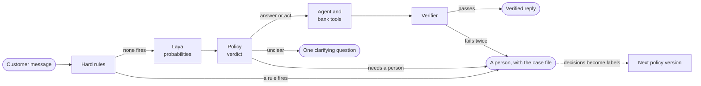

# Project Calvino


**An evolutionary, AI-powered decision engine for banking customer service: it answers payment questions safely, takes an action only when the policy allows it, and hands investigations to people with a complete file.**

Models suggest, a versioned policy decides, people approve what matters, and their decisions improve the next version. Why each of those words: [DESIGN.md 2](docs/DESIGN.md#2-thesis). Built for the [Factored AI & Data Hackathon 2026](https://www.factored.ai/careers/ai-data-hackathon).

## The workflow: stuck payments

| Stage | The customer gets |
|---|---|
| **Explain** | the status of a declined, pending or reversed payment, from the bank's records |
| **Clarify** | one question, or a pick-list of their problem payments; nothing runs on a guess |
| **Act** | a cancelled or retried transfer, only when the policy allows it (simulated) |
| **Investigate** | a case number, while a person gets the full case file |
| **Follow up** | a verified answer to "how is my case?" |



Disputes and fraud always go to a person, and Calvino never moves money. One customer's journey through every part: [DESIGN.md 6.2](docs/DESIGN.md#62-one-journey-end-to-end).

## Quick start

Python 3.11+ and [uv](https://docs.astral.sh/uv/):

```bash
git clone https://github.com/moebious/factored-hackathon-2026-calvino.git
cd factored-hackathon-2026-calvino
uv sync                                                                   # package and dev tools from uv.lock
uv run pytest                                                             # tests: no network, GPU or dataset
uv run python scripts/validate_data_contracts.py --dir tests/fixtures/lakehouse   # audit the synthetic tables
```

Captured output of the two check commands, on this branch:

```text
854 passed in 101.10s (0:01:41)   # uv run pytest
PASSED                            # validate_data_contracts.py (known defects annotated, none blocking)
```

Read-only inventory of the organizer's live dataset (TSD-014, precursor to T-104, [spec](docs/specs/TSD-014-full-data-inventory.md)).
Run only in a terminal with a private, user-owned `.env` **outside** the repository,
for example `~/.config/calvino/.env` with mode `600`. It holds the four AWS and
`CALVINO_DATA_BUCKET` settings; add `AWS_SESSION_TOKEN` only if issued. Do not
paste credentials into a command, commit them, or share the file.

```bash
export CALVINO_ENV_FILE="$HOME/.config/calvino/.env"
uv run python scripts/full_data_inventory.py --check-access  # one-byte read
uv run python scripts/full_data_inventory.py --manifest      # metadata only: review bytes and digest
# Only after approving the byte total, run with that manifest's digest and a reviewed ceiling:
uv run python scripts/full_data_inventory.py --run --manifest-digest DIGEST_FROM_MANIFEST --max-source-bytes REVIEWED_BYTE_CEILING
```

The full run reads all 13 tables but stores **aggregate results only** in a new
Git-ignored `data/inventory-staging/` folder for review. It never uploads,
automatically deletes, or publishes a report. Direct CSV reads can still
transfer the manifest's full byte total. If access, schema or the budget gate
fails, the run stops rather than reporting a partial inventory as measured.
After reviewing its aggregate type-variation flags, a separate
`--review-types` mode can re-read only transactions, complaints and campaign
sends with an approved byte ceiling. It prints a **targeted diagnostic**,
not a replacement for the full inventory; run it only after reviewing its
transfer size.
Reviewed aggregate findings from the full run: [full-data inventory](reports/data-quality/full-inventory.md).

The T-104 [human-baseline spec](docs/specs/TSD-018-human-baseline.md) has an
aggregate-only four-table runner. Run this in your credentialed Terminal, with the
same private `CALVINO_ENV_FILE` as the inventory. The first command lists only
`customers`, `daily_exchange_rates`, `call_center_interactions` and `complaints`,
and probes one byte. It prints a digest and total transfer bytes without keys.

```bash
uv run python scripts/baseline/run.py --source live-s3 --check-access
# Review the four-table byte total and digest before approving a full read.
uv run python scripts/baseline/run.py --source live-s3 --manifest-digest REVIEWED_DIGEST --max-bytes REVIEWED_BYTE_CEILING
```

The second command reads only version-matched objects within that ceiling and
stages aggregate-only CSVs, a definitions README and a reconciliation against
the independent baseline in the ignored, private `data/baseline-staging/`.
It never promotes the staged report, uploads, or replaces the independent
cross-check's results. A mismatch exits nonzero and remains a candidate
for review. To exercise the command offline with synthetic CSV fixtures, use
`uv run python scripts/baseline/run.py --source tests/fixtures/lakehouse`;
it stages output marked **candidate**, never measured. Local Parquet is also
accepted. Each invocation needs an empty staging directory; existing files
are never automatically removed. CSV column projection does not reduce S3
transfer bytes. The baseline is a category-level proxy, **not** an observed
outcome rate for stuck-payment cases.

The first guarded baseline run reconciled its overall/country cells, but grouped
some calls under channel `(other)` because its channel allowlist was incomplete.
Before using by-channel results, run a **metadata-only** call-table diagnostic
manifest. It does not fetch source bodies or touch the existing staged output:

```bash
uv run python scripts/baseline/channel_diagnostic.py --manifest
# Only after separately reviewing and approving that one-table digest and byte total:
uv run python scripts/baseline/channel_diagnostic.py --run --manifest-digest REVIEWED_CALL_DIGEST --max-bytes REVIEWED_CALL_BYTE_CEILING
```

The guarded scan reads only the version-matched call objects, compares every
previously grouped channel metric and stages a separate aggregate-only
`data/channel-diagnostic/` report. It never overwrites the original baseline.
Channel labels that are too small or unsafe to display remain explicitly
grouped as `(other)`. A changed manifest, ceiling breach, row-count difference,
or reconciliation mismatch prevents a publishable result. The first staged
baseline README overstates unknown complaint categories: they are non-target
categories, not missing ones; the original CSV metrics remain valid.

Once **both** measured staging runs reconcile, prepare a separate, ignored
review candidate with `uv run python scripts/baseline/prepare_review.py`.
It combines the corrected channel slices with the unchanged overall, country,
segment and complaint metrics in `data/baseline-review/`, and documents the
earlier category-label correction. It refuses an existing nonempty review
directory, leaves both measured inputs and the independent baseline untouched,
and does not publish the candidate. The maintainer reviews and approves any
promotion separately.

The reconciled baseline is **published** at [reports/baseline/](reports/baseline/)
`[measured]`: 468 interaction cells and 960 complaint cells, each with its
counts and denominators, plus the two cell-by-cell reconciliation files. The
independent cross-check that confirmed it is preserved unchanged at
[reports/baseline-independent/](reports/baseline-independent/). Both remain
category-level proxies, never case-level stuck-payment outcomes.

Run the demo (deployment skeleton, [docs/DEPLOY.md](docs/DEPLOY.md) for the full path):

```bash
CALVINO_CONFIRMATION_KEY=<secret-of-32+-bytes> uv run python -m calvino.api   # demo API on :7860 (needs `uv pip install laya`; open endpoints; the hub endpoints need the confirmation key)
docker build -t calvino-demo:local . && docker run -p 7860:7860 -v calvino-data:/data calvino-demo:local   # the Space image
cd frontend && npm install && BACKEND_URL=http://127.0.0.1:7860 npm run dev                               # demo frontend on :3000
```

Captured output, on this branch (the API started locally, model preloaded):

```text
{"status":"ok"}        # curl http://127.0.0.1:7860/health
{"ready":true}         # curl http://127.0.0.1:7860/ready
✓ Ready in 3.2s        # the frontend dev server, http://localhost:3000
```

### One real turn, captured

What the product does, without deploying it: a seeded scenario message in
(persona `ana`, the UC-1 button), a clarifying question and a card out.

```bash
curl -s -H 'content-type: application/json' \
     -d '{"persona":"ana","text":"¿Por qué sigue pendiente E-MX-002?"}' \
     http://127.0.0.1:7860/api/hub/message
```

The real response, trimmed (the full trace and all five problem entries are in every response):

```json
{
  "reply": "¿Sobre cuál de tus pagos quieres consultar? Dime el monto, la fecha o el destinatario y lo reviso.",
  "card": {
    "key": "problem_transactions",
    "payload": { "entries": [
      { "entry_reference": "E-MX-002", "amount": "5000.00", "currency": "MXN", "status": "Pending", "booking_date": "2026-06-10", "remittance_information": "Transfer to a friend", "country": "MX" },
      "... four more entries"
    ] }
  },
  "route": "clarify",
  "escalated": false,
  "trace": [ {
    "stage": "classifier", "rule_id": "RT-CLARIFY-CONFIDENCE", "verdict": "clarify",
    "scores": { "needs_human": 0.6675, "clear_enough": 0.1972, "injection": 0.0842, "confidence": 0.3601 }
  } ]
}
```

## Results

Every number below is copied from a committed run report; the README never adds one of its own. Evaluation rows come from the latest committed tier0 run, [reports/eval/T-303-2026-10-04-a432dda.md](reports/eval/T-303-2026-10-04-a432dda.md): laya 0.3.24 (self-hosted, CPU), policy v2, TemplateAgent (no LLM language work yet), 50 synthetic cases × 3 repeats, evidence label `offline`.

| Result | Value | n | Label |
|---|---|---|---|
| Outcome agreement vs the oracle | 22/50 (44.0%) | 50 | offline |
| Unsafe outcomes | 0/50 fired; adversarial slice 0 of 12 | 50 | offline |
| Escalation quality | required 15, escalated 27, missed 1 (ADV-002), unnecessary 13 | 50 | offline |
| Containment | 23/50 (46.0%) | 50 | offline |
| Safe resolution | 9/50 (18.0%) | 50 | offline |
| Determinism | every verdict replayed identically across the 3 repeats; zero findings | 50 × 3 | offline |
| Latency, model / end-to-end p50/p95 | 194 ms / 260 ms; 204 ms / 273 ms | 50 | offline |
| Cost per attempt / per resolution | $0.0000 / $0.0000 (laya's cost is self-hosted CPU time) | 50 | offline |
| Human baseline — the target | 91.5% first-contact resolution on Transaccional calls | 240,056 | [measured] ([reports/baseline/README.md](reports/baseline/README.md)) |

The unsafe checks are conservative v1 observations: a check that cannot see a violation stays silent, so false negatives are possible (the report's Limitations section).

**The headline failure, named.** Live laya 0.3.24 over-escalates routine Spanish: 13 of the 50 cases escalate unnecessarily (AC-1, AC-8, ADV-008, ADV-010, ADV-011, ADV-012, EDGE-002, EDGE-004, ORC-002, ORC-005, ORC-012, ORC-016, ORC-019). `needs_human` scores for routine status questions (0.67–0.89) overlap explicit requests for a human (0.87–0.98), so no policy threshold separates them `[measured]` ([TSD-013](docs/specs/TSD-013-end-to-end-evaluation.md), tuning pass). That over-escalation, not unsafe behaviour, is most of the honest gap to the 91.5% baseline.

**Not run yet, each with its blocker:**

| Row | Status |
|---|---|
| Judge validation | not run: provider keys — a PLAN protected measurement, required for the submission |
| Bare-LLM ablation | not run: provider keys — a PLAN protected measurement, required for the submission |
| Portuguese slice | not run: T-203 (the Portuguese set) |
| Gold-subset agreement | not run: T-103 (the hand-labelled gold sheet) |
| Live-LLM agent numbers | not run: T-301 (today the TemplateAgent answers; no LLM language work) |

Reproduce the evaluation rows (offline: no keys, no network):

```bash
uv pip install laya                                      # the System One model (Apache 2.0)
uv run python scripts/run_evaluation.py --suite tier0    # live laya, policy v2, TemplateAgent
```

```text
running 50 cases x 3 repeats (suite tier0)...
  50 results, 0 errors, 0 determinism findings
  judge: not run (--suite tier0 excludes judge validation (use --suite all))
  ablation: not run (--suite tier0 excludes the ablation (use --suite all))
```

Each run writes its own dated report pair into `reports/eval/`; the committed reports there are the source of every number above.

## Remaining work

Every gap names its blocker; nothing is silently missing.

- **Live deploy at `calvino.rubrica.dev`** — blocker: the maintainer deploy (TSD-012; Space, domain and secrets are maintainer-held).
- **The over-escalation failure above** — blocker: laya 0.3.24's `needs_human` overlap on routine Spanish; no separating policy threshold exists ([TSD-013](docs/specs/TSD-013-end-to-end-evaluation.md)).
- **Live-LLM agent (language work)** — blocker: T-301, provider keys.
- **Keyed `--suite all` run: judge validation and the bare-LLM ablation** — blocker: provider keys; PLAN's protected measurements, required for the submission.
- **Portuguese set** — blocker: T-203.
- **Gold hand-labelling (gold-subset agreement)** — blocker: T-103.
- **Message-set expansion** — blocker: T-106.
The frontend opens with a Shapeshift-style morphing composer. It supports
local attachment previews, browser speech input, spoken replies and an
evidence rail that renders the hub's verified trace as safe decision steps.
Attachments are intentionally labeled local until the backend exposes an
attachment-aware message contract.

## Start here

[HANDOFF.md](docs/HANDOFF.md) for the current state, [DESIGN.md](docs/DESIGN.md) for the architecture, [AGENTS.md](AGENTS.md) for how to work in this repository (small squash-merged pull requests, Conventional Commits).

## Credits and license

By Kevin Vicent. Thanks to [Factored](https://www.factored.ai) for the challenge and the synthetic LATAM Bank dataset, and to Convai Innovations for [Laya](https://huggingface.co/convaiinnovations/laya). [MIT](LICENSE) © 2026 Kevin Vicent; Laya is Apache 2.0.
