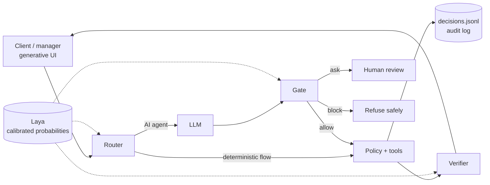

# Project Calvino

> **Project status:** design phase, built for the [Factored AI & Data Hackathon 2026](https://www.factored.ai/careers/ai-data-hackathon) (submission: 2026-10-05). The architecture is documented; the code is not written yet. Sections below say plainly what exists and what is planned.

**An AI-first banking customer service system where a domain-specific harness, not the model, decides what is safe to automate and when a human is needed.**

> Laya is System 1, Calvino is System 1.5, agents are System 2, and humans are System 3. Calvino, the hub, decides who acts, gates every action, verifies agents' work and learns from every human decision.

## Description

Banks want AI to resolve customer requests, but a language model on its own can't be trusted to decide what it is allowed to do, whether its answer is grounded, or when a person should take over. Project Calvino puts those decisions in the **harness**: the code around the model.

The idea follows the definition **Agent = Model + Harness** ([The Anatomy of an Agent Harness](https://www.langchain.com/blog/the-anatomy-of-an-agent-harness)). The model provides the intelligence; the harness makes it useful and safe. Calvino splits the work four ways:

| Who | Does what | Example |
|---|---|---|
| **Deterministic code** | Anything with exact rules, money or permissions | authentication, record ownership, limits, confirmations |
| **System One model** ([Laya](https://huggingface.co/convaiinnovations/laya)) | Fast, calibrated judgments with typed answers, no generated text | intent, "does this need a human?", injection risk |
| **LLM** | Open-ended language | clarifying questions, explanations, handoff summaries |
| **Human** | Judgment with accountability | approvals, high-value disputes, vulnerable customers |

Inside Calvino, the core principle is **probabilities in, deterministic verdicts out.** Laya returns calibrated probabilities; a versioned, unit-tested policy function turns them into a verdict; hard rules (fraud signals, amount limits, an explicit request for a person) always win. Every verdict is logged and can be replayed.

### Planned features

- **Human intervention classifier.** Before involving a person, the harness asks whether it's worth it, and how: approve one action, request information, or transfer the whole case.
- **Mode classifier.** Sends each request to a fixed deterministic flow, the AI agent, or a human.
- **Router, Gate and Verifier.** The harness picks the model for each request, checks every tool call before it runs, and verifies the final answer is grounded before the customer sees it.
- **Durable cases.** Disputes that last days pause for human approval and resume with full state.
- **Generative UI.** Clients and managers see outcomes (cards, confirm buttons, case status), not the machinery.
- **Spanish and Portuguese,** with fairness checks across dialects, countries and customer segments.

### How it differs

- **From "LLM does everything":** decisions are cheap, typed and calibrated instead of parsed from prose, and nothing with consequences rests on a single probability.
- **From hosted classifiers such as TypeSafe Jev:** Laya is open-weight (Apache 2.0) and self-hosted, so customer text never leaves the bank, and it can be fine-tuned and recalibrated on the bank's own data.

### Why "Calvino"?

After Italo Calvino's *Invisible Cities*. Each harness is a self-contained city with its own rules; state passes between cities only through defined contracts; and, like Marco Polo describing cities to the Khan, the interface turns hidden machinery into an account the reader can follow.

## Visuals

Architecture (planned). Screenshots and a demo recording will be added once the prototype runs.

## Installation

Not runnable yet; setup steps will land with the first code.

### Requirements (planned)

- Python 3.10 or newer
- About 1 GB of disk for the Laya multilingual checkpoint (downloaded on first use)
- A GPU is optional: Laya runs on CPU at roughly 0.2–0.4 s per call `[measured]`, ~33 ms on GPU `[vendor]`
- Access to the hackathon dataset, configured through environment variables (never committed)

## Usage

Coming with the prototype: a demo conversation for each path (normal resolution, ambiguous request, human handoff), in Spanish and Portuguese, plus an evaluation command that reproduces the reported metrics.

## Roadmap

- [x] Design document, decision log and repository standards
- [ ] Data pipeline with contracts and quality checks
- [ ] Laya classifiers: zero-shot baseline, calibration, fine-tuning
- [ ] LangGraph harness: Router, Gate, Verifier, human interrupts
- [ ] Mock banking tools behind an MCP server, with authentication
- [ ] Generative UI (CopilotKit / AG-UI)
- [ ] Evaluation against baselines, including fairness and failure cases

Each milestone is tagged as a version (`v0.1.0` design → `v1.0.0` submission); see [AGENTS.md](AGENTS.md#git-workflow) and [CHANGELOG.md](CHANGELOG.md). Details: [docs/PLAN.md](docs/PLAN.md).

## Documentation

- [docs/BRD.md](docs/BRD.md): business requirements: problem, goals and KPIs, scope
- [docs/PRD.md](docs/PRD.md): product requirements: use cases, requirements, acceptance criteria
- [docs/DESIGN.md](docs/DESIGN.md): software design: architecture, governance, fairness, evaluation plan
- [docs/specs/](docs/specs/README.md): technical specifications, one per work stream
- [docs/ROADMAP.md](docs/ROADMAP.md): work streams and the order they are built in
- [docs/tasks/](docs/tasks/README.md): backlog of every remaining task and how sessions pick them up
- [docs/HANDOFF.md](docs/HANDOFF.md): start here when joining the project
- [docs/BRIEF-COVERAGE.md](docs/BRIEF-COVERAGE.md): every requirement in the brief mapped to the design
- [docs/DATA.md](docs/DATA.md), [docs/GLOSSARY.md](docs/GLOSSARY.md), [docs/references/](docs/references/README.md), [docs/PITCH.md](docs/PITCH.md)
- [docs/DECISIONS.md](docs/DECISIONS.md): decision log
- [docs/PLAN.md](docs/PLAN.md): build plan, risks, blockers
- [CHANGELOG.md](CHANGELOG.md): changes per version

Claims in the docs carry evidence labels: `[measured]` (we ran it), `[vendor]` (published by a model's author, not reproduced), `[read from chart]`, `[hypothesis]`.

## Support

Open an issue on [GitHub](https://github.com/moebious/factored-hackathon-2026-calvino/issues).

## Contributing

Contributions and feedback are welcome. Work happens on feature branches and reaches `main` through small pull requests (squash-merged). Repository standards, the git workflow, commit conventions and design rules, for humans and coding agents alike, are in [AGENTS.md](AGENTS.md). Every branch gets its own git worktree and nothing is committed on `main`. After cloning, set up the worktree layout and enable the repository's git hooks with `git config core.hooksPath .githooks`; setup and test commands are listed in [AGENTS.md](AGENTS.md#commands).

## Authors and acknowledgment

**Author:** Kevin Vicent.

Built on ideas and tools from:
- [Factored](https://www.factored.ai), for the challenge and the synthetic LATAM Bank dataset
- [Laya](https://huggingface.co/convaiinnovations/laya) by Convai Innovations
- *The Anatomy of an Agent Harness* (V. Trivedy) and *Building a Harness with Jev* (S. Runkle, H. Lovell), LangChain
- *Building a Custom Harness with Pi and Jev*, DAIR.AI Academy
- *Harness design for long-running application development*, Anthropic
- Italo Calvino, *Invisible Cities*

## License

[MIT](LICENSE) © 2026 Kevin Vicent. Third-party models and libraries keep their own licenses (Laya: Apache 2.0).
