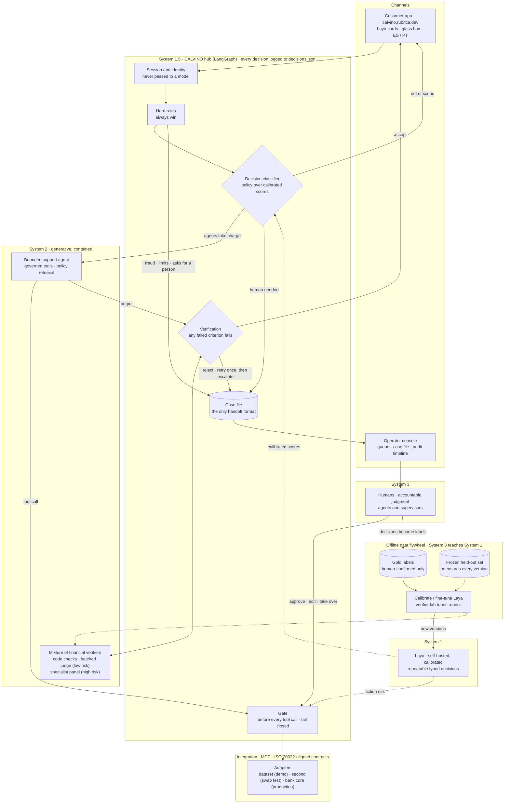
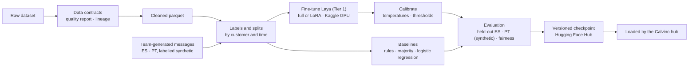

# Project Calvino: Design

*Software Design Document (SDD): how the system is designed. Requirements are in [BRD.md](BRD.md) (why) and [PRD.md](PRD.md) (what); build specifications are in [specs/](specs/README.md).*

> **Status:** the workflow is stuck payments, end to end (decision 17, [section 6.1](#61-the-workflow-stuck-payments-end-to-end)). Data contracts, the hub and the customer app are built; the thesis experiments in decisions 34–37 are planned, not measured. Decisions are logged in [DECISIONS.md](DECISIONS.md).
>
> **Evidence labels:** `[measured]` we ran it ourselves · `[vendor]` published by the model's author, not reproduced by us · `[read from chart]` approximate value read from a published chart · `[hypothesis]` design assumption still to be tested.
> **Context:** Factored AI & Data Hackathon 2026, "Build an AI-first banking customer service system."

---

## 1. Name and metaphor

*Calvino* is named after Italo Calvino's *Invisible Cities*. It is also the working name of a methodology for **harness engineering**.

| In the book | In Calvino |
|---|---|
| Each city is self-contained, with its own rules | Each **harness** is an isolated environment with its own tools, policy and boundary |
| Marco Polo first talks to Kublai Khan without a shared language, through gestures and objects | A **System One model** (Laya) never writes prose. It returns typed signals the harness can act on directly |
| Polo turns cities the Khan will never visit into accounts he can understand | **Generative UI**: clients and managers see outcomes, never the machinery |
| Communicating vessels (the methodology's own image) | State moves between isolated environments **only through contracts**: the case file, the decision log, the handoff packet |

## 2. Thesis

> **Laya is System 1, Calvino is System 1.5, agents are System 2, and humans are System 3.**
> Calvino is the bridge: it turns fast, repeatable signals into governed verdicts, contains the non-determinism of generative agents with a mixture of efficient financial verifiers, and turns every governed run into data that improves System 1 and the verifiers.

Inspired by Kahneman's System 1 (fast, automatic) and System 2 (slow, deliberate). This is an engineering analogy, not a claim about cognition: Systems 1.5 and 3 are this project's extensions.

| System | Component | Role | Property | Evidence it holds |
|---|---|---|---|---|
| **1** | **Laya** | fast perception: intent, risk, whether a human is needed | non-generative and **repeatable**: one forward pass, no sampling, so the same input always gives the same calibrated probabilities | calibration (ECE, Brier), overall and per language |
| **1.5** | **Calvino**, the hub | the bridge: turns System 1 signals into deterministic verdicts, routes work to agents or humans, gates every action, records everything | **deterministic and governed**: versioned policy, fails closed, every decision replayable | replaying the log gives the same verdicts; unsafe outcomes with their denominators |
| **2** | **Bounded support agent** checked by a **mixture of efficient financial verifiers** | slow, generative language work; a company-brain or coworker agent is not required for the current workflow | generative, so not deterministic, but **contained**: fixed rubrics, structured verdicts, fixed aggregation rules | verifier false-pass rate, judge agreement, re-run variability |
| **3** | **Humans** | accountable judgment: approvals, exceptions, edge cases, empathy | the final authority; slowest and most expensive | escalation quality: missed and unnecessary transfers |

**An escalation ladder.** Each step up is slower and more expensive, and holds more responsibility. Calvino resolves each case at the **lowest system that can do it safely** and passes it up when confidence or policy requires. Levels can be skipped: a hard rule (fraud signal, explicit request for a person) goes straight from System 1.5 to System 3.

**The rule inside System 1.5: probabilities in, deterministic verdicts out.** The probabilistic signal never decides on its own:

```
Laya probabilities  ->  policy function (thresholds + hard rules)  ->  verdict
  (probabilistic)          (deterministic, versioned, unit tested)      (logged)
```

The same inputs and the same policy version always give the same verdict. Every verdict can be replayed from `decisions.jsonl`.

**Containing System 2.** Worker agents stay generative; the verifiers make their output predictable *at the boundary* (see [4.4](#44-verifier-design-layer-2)). Anything outside the rubric is rejected, independent judges reduce the variance of the final verdict (any failed criterion fails the output), and every verdict is logged, so the remaining non-determinism is **measured, not assumed away**.

**A data flywheel: System 3 teaches System 1.**

```
governed decisions -> audit log -> human decisions -> gold labels -> recalibrated / fine-tuned Laya, tuned judge prompts
        ^                                                                                         |
        +-----------------------------------------------------------------------------------------+
```

A flywheel can feed on its own mistakes, so it runs with safeguards:

- **Only human-confirmed labels** go back into training or calibration. Model and verifier outputs alone never do.
- A **frozen held-out set** never enters the loop and measures whether each new version really improves.
- **Audit sampling** of auto-resolved cases, so automated decisions also receive human labels, not just escalated ones.
- A **fairness check per version** (language, dialect, segment) before anything is promoted.

The planned flywheel demonstration is **one offline turn** (human-labelled cases → recalibration or retraining → measured change on the frozen set), labelled as offline rather than a production result.

**Implementation boundary (decision 34):** automate offline preparation, lineage, retraining, evaluation and candidate reporting as far as practical; a person reviews labels and compliance signs off before promotion. A late or corrected source record must invalidate and rebuild affected labels and evidence without contaminating the frozen test set (T-105). Replay a candidate policy against logged, replayable decisions to show every changed verdict; judge safety regressions against an independent oracle or reviewed labels, not the policy's own verdicts. An unchanged or rejected candidate is an honest flywheel result. These demonstrations remain planned until their reports exist.

**Where the novelty is.** Fast/slow agent designs and "System One" decision models already exist. Calvino's contribution is System 1.5, a governed bridge with calibrated thresholds and a deterministic policy for a regulated domain; the mixture of financial verifiers; and the flywheel with its safeguards.

**What Calvino is.** An **evolutionary, AI-powered decision engine** for banking customer service: it answers payment questions safely, takes an action only when the policy allows it, and hands investigations to people with a complete file. *Decision engine*: every consequential choice is a verdict from the versioned policy (probabilities in, deterministic verdicts out). *AI-powered*: Laya and the LLM feed it without deciding. *Evolutionary*: human decisions become labels, and each improvement ships as a new policy version after replay and evaluation; it never rewrites itself. In engineering terms it is a domain-specific harness. Against three published definitions of a harness:

- *A layer of code, rules, tools and workflows that makes a general model reliable in one domain* (J. Avedra): Calvino is tuned to one vertical's tools, workflow and failure modes. It departs on purpose from that post's self-editing harness: agents never edit prompts, policy or routing; improvement goes through versioned files, replay and evaluation.
- *Tools and engines, rules, checks* (Obversa): each engine has one job (Laya classifies, the policy decides, the LLM writes, the judge checks, people approve); the stages run in order with per-stage tool lists and a versioned playbook (decision 24); a checker from another model family fails a stage with findings (decision 20). Unlike document workflows, a person is at the end of every *consequential* action, not of every case.
- *System prompt, tools, agentic loop, translation layer across models* (C. Daymond, Earendil): all four are present, but the post's harness lets the model decide when and how to use tools; in Calvino the Router and the Gate decide, and the model can propose an action but never authorize it.

## 3. Where AI is appropriate and where it isn't

| Mechanism | Use when | Examples |
|---|---|---|
| **Deterministic code** | Rules are known, exact correctness is required, money or permissions are involved | authentication, record ownership, limits, confirmations, card blocking, case creation |
| **System One (Laya)** | Fuzzy judgment with a measurable right answer; must be fast, cheap and calibrated | intent, handling mode, needs-a-human, injection risk, groundedness |
| **LLM** | Open-ended language with no single right answer | clarifying questions, explanations grounded in verified facts, handoff summaries |
| **Human** | Judgment with accountability, edge cases, empathy, required by policy | approvals in the gray band, high-value disputes, vulnerable customers |

## 4. Architecture

### 4.0 Hub and spoke

**Calvino is the hub**: the domain-specific harness at the center. Everything else is a spoke (channels, agents, humans, models, bank integrations) and **spokes never talk to each other directly**. Every handoff, tool call and decision passes through the hub, where it is classified, gated, verified and recorded. As in *Invisible Cities*, each city is self-contained and the empire knows it only through the accounts that reach the center.



Models are spokes too: Laya (decisions), the agents' LLM and the LLM judge are called only by the hub or by agents under the hub's gate. The **two classification layers** are the core of the design:

| Layer | Question | Mechanism | Outcomes |
|---|---|---|---|
| 1. Decision classifier | *Who* should act: agents or a human? | hard rules, then calibrated Laya probabilities, then the policy function | agents take charge · human needed (approve, request info, full transfer) |
| 2. Verifier cascade | Is the agents' work *good enough*? | deterministic checks, then Laya, then a batched LLM judge over a criteria rubric (see [4.4](#44-verifier-design-layer-2)) | accept · retry (bounded) · escalate to a human |

**Trade-off:** a hub is a single point of control, so it is also a potential bottleneck and single point of failure. The hub keeps no state between requests (state lives in the checkpointer and the case file), so it scales horizontally; Laya calls are cheap; and every spoke has a defined behavior when the hub or a model is unreachable (fail closed for actions, fail open for model choice).

### 4.0.1 Offline ML pipeline



Classifier text is **team-generated** (decision 16): the dataset's transcripts are templated, so the messages Laya learns and is evaluated on are drafted from dataset scenarios and reviewed by hand, while the dataset supplies structured context and outcomes. Fine-tuning teaches Laya to make **decisions on our kind of input**; it does not store the dataset in the model. At runtime, account data reaches agents only through the MCP tools, under the gate.

### 4.0.2 Deployment

| | Demo (hackathon) | Production reference (documented) |
|---|---|---|
| Public link | `calvino.rubrica.dev` (custom subdomain on Vercel; `/api/*` rewritten to the backend, so judges see one URL) | Bank-owned domain |
| Customer app and console | Vercel | Bank web and mobile channels |
| Calvino hub + Laya | Hugging Face Space (CPU, weights baked into the image, keep-alive ping) | Containers in a private AWS VPC behind API Gateway (container services rather than Lambda: Laya needs ~1 GB of model in memory and steady latency) |
| LLM for agents and judge | Hetzner's Inference API for the agent role, a second provider for the judge (decision 28); free while experimental, so a fallback is configured | Amazon Bedrock inside the VPC boundary |
| Bank integration | MCP dataset adapter over a small labeled sample | MCP adapter to the bank core |
| State and audit | SQLite checkpointer and `decisions.jsonl` on the Space's persistent storage (or an external database), so cases survive restarts | managed database, append-only audit store |

### 4.0.3 Components

| Layer | Responsibility | Technology |
|---|---|---|
| Project | Package, dependencies, lint, tests, CI | Python 3.11, `uv`, pydantic v2, ruff, pytest, GitHub Actions |
| Channels | Customer app with Laya-chosen cards and a glass-box panel; operator console (OpenBot-style queue, case view, audit timeline) | Next.js on Vercel; CopilotKit/AG-UI for the console (Tier 2) |
| API | The hub's HTTP surface for the apps | FastAPI on a Hugging Face Space (Docker, persistent storage) |
| Hub orchestration | Decision classifier, Gate, Verifier cascade, durable cases, human interrupts | LangGraph (checkpointer + `interrupt()`) |
| Agents | Bounded support chat with policy retrieval; optional later coworker | LangGraph agent interface, versioned prompts; no computer use |
| Fast decisions | Typed, calibrated classification | Laya (`laya-multilingual`, self-hosted; fine-tuning and held-out comparison are core thesis evidence, decision 34) |
| Policy | Thresholds, hard rules, permissions | Plain Python, versioned, unit tested |
| Integration | Governed access to bank data and actions | MCP servers with the official MCP Python SDK (one adapter per bank core) |
| Data | Clean layer, contracts, quality report, baseline | Parquet lakehouse queried with DuckDB (the analyst's pipeline) |
| Governance | Contracts, audit, redaction, lineage, tracing | data contracts, `decisions.jsonl` (`calvino.decision_log`), traces |
| LLM | Agents and the judge | open models (decisions 20, 28 and 29): a Qwen model for the agent on Hetzner's Inference API, a model from another family as the judge on a second provider; Amazon Bedrock in the production reference |

### 4.1 The hub's three checkpoints (after "Building a Custom Harness with Pi and Jev", ported to LangGraph + Laya)

| Part | Hook | Laya questions | Policy | If Laya is down |
|---|---|---|---|---|
| **Router** | Start of a request (chosen once, so the prompt cache holds) | handling mode, complexity | low confidence goes to the safer path (two thresholds, `decide_route`) | the policy itself **fails closed** on missing scores (to a person, decision 18); a rules-based fallback classifier, if used, runs in the hub before the policy |
| **Gate** | Before every tool call | risk of the action (destructive, irreversible, out of scope) | `decide_gate()`: allow / ask a human / block | **fail closed**: block, or escalate |
| **Verifier** | Before the final answer | answer quality, groundedness | at most 2 attempts | treat the answer as unverified and escalate |

### 4.2 The two Calvino classifiers

| | **Mode classifier** (front door) | **Human intervention classifier** (checkpoints) |
|---|---|---|
| Question | How should this request be handled? | Is a human worth involving, and how? |
| When | Start of each request | Before consequential actions, after tool failures, before the final answer |
| Output | `deterministic_flow` / `ai_agent` / `human` / `out_of_scope` | `none` / `approve_action` / `request_info` / `full_transfer` |
| Fallback | rules-based classifier, else `ai_agent` | escalate |

**Unsupported requests** (`out_of_scope`: outside the chosen workflow, or something the bank does not offer) get a short, honest reply saying what Calvino can't do here, the right channel for it, and an offer to reach a person. No agent is started and nothing is guessed.

**Hard rules run before Laya and always win.** Some cases go to a human regardless of probability: confirmed fraud signals, amounts above a limit, complaints received through the regulator, vulnerable-customer signals, repeated authentication failures, an explicit request for a person. Laya decides the gray zone.

### 4.3 Laya usage rules (from its documented limits and our smoke test)

1. **Not a zero-shot decision engine.** Base checkpoints are near chance on typed decisions. Fine-tune and/or calibrate before trusting it.
2. **Calibrate on our data.** Fit one temperature per (question type, option count) on a *calibration split*, never on the test split. Laya's own numbers: ECE 0.314 -> 0.106 (multilingual) `[vendor]`.
3. **Pin `laya-multilingual` for customer text,** so every customer gets the same calibrated model. Report calibration per language and dialect.
4. **Avoid `score` questions for decisions that matter** (weakest question type `[vendor]`; our urgency test was flat `[measured]`). Use ordered `choice` questions instead.
5. **Ask critical yes/no questions as two-option choices with neutral keys** (yes/no answers can follow their labels instead of the input).
6. **Never gate on `action.act_probability`** (no signal). Gate on calibrated probabilities and `confidence`.
7. **Keep choice questions to 10 options or fewer;** go coarse to fine (workflow area, then intent). The dataset has only one reason level (six categories), so finer intents come from our own label set.
8. **Known weak spot:** routing-style questions on the multilingual checkpoint (0.123 held-out in Laya's benchmarks `[vendor]`). Measure before trusting; keep a rules-based fallback.
9. **Injection:** Laya is one signal (~0.71-0.76 on held-out jailbreaks `[vendor]`). Deterministic guards and the tool-call gate stay load-bearing.
10. **Serving:** in-process, or `laya-serve` only with `LAYA_API_KEY` and a private bind. Preload checkpoints at startup.

**Smoke test `[measured]` (2026-10-01, CPU, zero-shot, n=5, a sanity check, not evidence; run before the workflow was chosen, so its intents are generic):**

| Input | Intent | needs_human | Latency |
|---|---|---|---|
| ES-MX balance inquiry | balance_inquiry | 0.01 | 349 ms |
| ES stolen card + unknown charges + "talk to someone now" | block_card | 0.94 | 378 ms |
| ES-AR declined card | card_declined | 0.17 | 349 ms |
| PT unrecognized charge | unrecognized_charge | 0.24 | 333 ms |
| EN prompt injection | other | 0.20 (not flagged) | 19 s (cold load, English checkpoint) |

Urgency (`score`) was flat at 1.62-1.78 for every input.

### 4.4 Verifier design (layer 2)

After *Designing Efficient Verifiers for Legal Agents* (LangChain Labs and Harvey). Their findings that shape this design `[vendor]`: rubric-based judging with a pass/fail verdict per criterion; judging the whole rubric in one **batch** call is about an order of magnitude cheaper than one call per criterion, with somewhat lower agreement; open models came close to a frontier reference at 60–1000× lower cost, while some cheap models were far too permissive (false-pass rates of 35–48%); even frontier judges agree only ~95.7% with each other; and prompting the judge to decompose each criterion into a checklist and to be cautious when unclear lowered false passes.

**Rubric, not a single grade.** Each agent output type (answer, action confirmation, case summary for an operator) has a versioned rubric of pass/fail criteria, for example:

| Criterion | Checked by |
|---|---|
| Every amount, date and merchant stated matches a tool result | deterministic |
| Every action claimed as done was verified by reading it back | deterministic |
| No data belonging to another customer | deterministic |
| Reply is in the customer's language | deterministic, with Laya for mixed language |
| Every factual claim is supported by tool results or policy documents | Laya, then LLM judge |
| The customer's question is fully answered, or the gap is stated | LLM judge |
| No invented policy, eligibility or promise | LLM judge |
| Next step and any required confirmation are stated clearly | LLM judge |

**Cascade, cheapest first.** Anything code can check is removed from the LLM rubric. Laya answers the simple grounding questions in one batched call. The LLM judge then labels **all remaining criteria in one batch call**, with checklist decomposition and an instruction to fail when unclear. Any failed criterion means retry once with the failure as feedback, then escalate to a human with the failed criteria in the case file.

**Optimise for false passes.** A false pass sends an unsafe or wrong reply to a customer; a false fail costs a retry or an operator minute. Judge choice and prompt tuning minimise false passes first, then cost.

**Validating the judge** (as the brief requires for any model used as a judge):

- A labelled sample of agent outputs, judged per criterion by a human against the rubric (the gold set), plus a strong model judging per criterion as a reference.
- Report for each candidate judge (cheap open model, frontier model) and mode (batch, per criterion): **agreement, false-pass rate, false-fail rate, cost per 1,000 criteria and latency**, with sample sizes.
- Don't target 100% agreement: the reported ceiling between frontier judges is ~95.7% `[vendor]`.
- Improve the judge from traces: review disagreements in the decision log and tune the prompt, re-measuring false passes each time.
- The runtime judge is an open model the bank can host, in line with keeping customer data in-house, and from a **different model family than the agent** it checks (decision 20); a frontier model can serve as the offline reference. Avoid permissive judges: in the study, the cheapest model wrongly passed 35–48% of criteria `[vendor]`.

**A mixture of financial verifiers, tiered by risk.**

| Risk (from System 1.5) | Verification |
|---|---|
| Low (balance answer, status inquiry) | the cascade above, with one batched judge call |
| Selected otherwise-allowed consequential stuck-payment actions | a **veto-only panel** of independently measured financial specialists checking documented evidence before execution; fraud, unsupported disputes and blocked actions still go to a person without asking the panel to grant authority |

Panel rules (decision 35 supersedes decision 21's placement): hard rules, ownership, eligibility, policy and exact typed confirmation run before the panel. For a versioned risk-tier of otherwise-authorized candidate writes, the panel runs **before execution** and can only veto into a human handoff. It never grants permission or overrides a block. Verifiers see the candidate and evidence, never the worker's reasoning; each returns structured pass/fail verdicts per criterion; the hub combines them with a fixed rule (any failed criterion fails), not a model. A timeout counts as a failure. Specialists report to the hub, never to each other. The panel's incremental false-pass reduction and cost must be measured against the existing cascade before a runtime claim is made.

**Offline verifier lab.** A reproducible benchmark outside the request path: it surfaces disagreements between judges and reviewed human labels, false passes and safety regressions. People design new deterministic checks, rubrics and prompts; the benchmark re-measures each proposal against development cases and a frozen promotion set, with false passes as the primary target. It does not autonomously rewrite its own rubric (decision 35).

## 5. Governance: constraints as enforceable controls

If a constraint isn't met, there is no governance. Each constraint has a metric, an enforcement mechanism and an explicit trade-off.

| Constraint | Metric | Enforced by | Trade-off |
|---|---|---|---|
| Privacy | unauthorized disclosures / attempts; PII reaching models | session-scoped tools, ownership checks in MCP servers, PII redaction, masked card numbers, self-hosted Laya | more tool calls |
| Explainability | % of decisions with a complete record | `decisions.jsonl` (inputs, Laya scores, rule fired, tool results) + checkpoints; never chain-of-thought | storage |
| Fairness | outcome and error gaps by dialect, country, language, segment, gender, age | per-group calibration, counterfactual tests, disparity alerts | possibly per-group thresholds (must be justified) |
| Reliability | safe-resolution rate, unsafe-outcome rate, fallback success | fail closed / fail open, bounded retries, Verifier | more abstention |
| Scalability | throughput, p95 under load, review-queue depth | stateless workers + checkpointer, cheap Laya calls, bounded queues | infrastructure |
| Cost | cost per attempted case and per successful resolution | Router, Laya instead of LLM decisions, prompt caching, per-case budget | cheap tier may lower accuracy |
| Latency | p50/p95 per turn and end to end, reported twice: model compute time and end-to-end time including the network, after one discarded warm-up request | batched Laya questions, timeouts, preload | each check adds ~0.2-0.4 s on CPU `[measured]`; a sleeping Space adds a cold start, reported separately |
| Effectiveness | safe automated resolution vs human baseline (`was_resolved`, `was_escalated`, handle time) | Verifier + evaluation suite | - |
| Human perspective | missed / unnecessary transfers, reviewer agreement, override rate | generative UI, handoff packet, review queue, manager view | human time is the scarcest resource |

**The central trade-off** is the gate thresholds. We choose them by expected cost:
`C_miss * missed_escalations + C_unneeded * unnecessary_escalations + C_review * reviews`.
We plot automation rate vs unsafe rate vs human load and justify the chosen operating point.

### 5.1 Fairness

Customers with the same need get the same quality of outcome, regardless of who they are or how they speak.

- **Conditional parity:** equal error rates across groups, not equal raw rates.
- **Calibration per group:** a 0.7 must mean 70% for every dialect and language, because thresholds act on these numbers.
- **Counterfactual consistency:** change only the dialect, name, gender or language, and the verdict must stay the same. Measure the flip rate.
- **Legitimate differences** (e.g. segment benefits) are documented policy, not model behavior.
- **Known gap:** Laya zero-shot is ~0.5 on Spanish/Portuguese intent vs ~0.8 English on MASSIVE `[vendor]` `[read from chart]`. All our customers are non-English, so this must be re-measured on our data.
- **Pass/fail lines** (decision 25) `[hypothesis]`: an error-rate gap under 5 percentage points between any two groups, and under 2% of verdicts flipping in counterfactual pairs. Groups under 30 cases are flagged, not failed. Gender and age exist only counterfactually (the dataset has neither). Group attributes are never decision inputs, except documented segment benefits.
- **Justified group thresholds** (decision 22): Portuguese, evaluated only on synthetic data, starts with a stricter margin to act and to clarify, and is relaxed only when calibration per language shows it is as reliable as Spanish.
- **Paired evidence** (decision 37): hold transaction facts and request meaning fixed across dialect/language variants, report model scores and calibration separately from policy verdicts, and name a documented stricter Portuguese policy flip as a policy difference **with its customer impact**, not as proof of model bias or as a hidden exemption. Small groups are inconclusive; the paired analysis is not yet an automatic promotion gate.

**Language coverage and limitations** (reported in the README with the results):

| | Spanish | Portuguese |
|---|---|---|
| Source of customer text | team-generated from dataset scenarios, Mexican, Colombian and Argentine variants (decision 16) | translated from held-out Spanish messages plus a smaller set written directly in Portuguese, all synthetic (T-203) |
| Used for | calibration, thresholds, evaluation; fine-tuning in the core thesis proof | evaluation only, never training or calibration |
| Customers and money | personas in MX, CO, AR; MXN, COP, ARS, USD | the same personas and currencies; no BRL, PIX or boleto, because the dataset has no Brazilian customers |
| Known gaps | dataset text is templated; no real customer messages | no native data; real Brazilian usage and slang are not represented |
| Safeguard | calibration per language | stricter thresholds until measured (decision 22) |

### 5.2 Security and integration

- The customer's session token is attached by the harness and **never passes through the model**. MCP servers check ownership.
- **Authentication in the demo** uses a trusted test session issued by the hub (signed, expiring) for each synthetic persona; a customer number or national ID typed in the chat never proves identity, as the brief requires.
- An allowlisted, versioned tool registry with a permission scope per tool. No general-purpose code execution.
- Confirmations are **typed UI events bound to the exact action payload**, not free-text "yes."
- PII redaction before the LLM; masked card numbers (PCI DSS). Data-protection and residency rules for MX/CO/AR are noted for production.
- **External model boundary:** Laya runs self-hosted, so customer text never leaves for System 1. The agents' LLM and the judge receive only redacted, minimal context. The dataset is synthetic, but the boundary is designed as if it were real: which fields may leave, to which provider, is part of the tool contracts.
- **Bank-action boundary (decision 36):** MCP exposes governed tool capabilities; a bank adapter translates an authorized, confirmed action into the agreed ISO 20022 message version and bank profile. The Calvino verdict and bank message are correlated but separate artifacts. A schema-valid message can still be financially wrong: deterministic checks must bind ownership, reference, amount, currency and idempotency to trusted evidence, then verify the bank response and read-back before claiming success. The demonstration uses mock middleware, one operation and labelled synthetic data; no general ISO compliance or live bank-core connection is claimed.

### 5.3 Operations

- **Data retention:** the decision log keeps decisions, scores, rules and tool outcomes, with PII redacted or tokenised; raw conversation text is kept only as long as the case is open plus a configurable retention period. Demo data is reset on restart.
- **Capacity** `[hypothesis]`: Laya on CPU handles roughly 2–5 decisions per second per core at the measured 0.2–0.5 s per call; the hub holds no state between requests and scales horizontally; the binding limits are LLM rate limits and human review capacity. Measured load figures will replace these estimates.
- **Monitoring:** per-decision latency and cost, verdict mix (automated / clarified / escalated), verifier false-pass sampling, review-queue depth, calibration drift per language.

## 6. Durable cases and human-in-the-loop

`[hypothesis]` Conversations take minutes, but **cases** last days (merchant evidence, customer documents, approvals). LangGraph's checkpointer plus `interrupt()` lets a case pause for a human, survive restarts, and resume with full state.

Lessons from Anthropic's long-running harness design, applied:

- **Separate the worker from the judge:** the Verifier is Laya plus deterministic checks, never the LLM grading itself.
- **Structured handoff artifacts:** the *case file* (verified facts, actions taken, evidence, open questions) is both the human handoff packet and the resume point.
- **A definition of done per workflow,** agreed before execution.
- **Every component encodes an assumption:** ablation studies show what is actually needed.

Human-in-the-loop layers: **confirm** (client, UI) -> **approve** (gray band, review queue) -> **escalate** (full transfer with the case file) -> **audit** (random sample of auto-resolved cases). Every human decision becomes a label used to recalibrate thresholds.

### 6.1 The workflow: stuck payments, end to end

Decision 17. A customer's payment or transfer is Declined, Pending or Reversed, and they ask where their money is. Each stage exercises a different part of Calvino:

| Stage | The customer sees | What runs |
|---|---|---|
| **Explain** | the status of their transaction, what it means and the next step | hard rules → Laya (workflow, clarity, needs-a-person) → policy verdict → MCP read tools with ownership checks → agent → verifier cascade |
| **Clarify** | one question, or a card of their recent problem transactions to choose from | Laya confidence below the threshold → clarification; the Gate refuses to act on a guess |
| **Act** | an offer to cancel a pending transfer or retry a declined one | the **Gate** with all three outcomes: allow (owner verified, eligible status, amount under the limit), ask a person (above the limit: `approve_action` interrupt), block (fraud signal, not the owner, ineligible status). Simulated by the dataset adapter, shaped as an ISO 20022 cancellation request (camt.056) and its answer (camt.029) |
| **Investigate** | a case number and a promise that a person has the full file | human intervention classifier → case file → operator queue → durable case (checkpoint plus `interrupt()`), shaped as an investigation (camt.027) |
| **Follow up** | later, "how is my case?" answered with a verified status | the case resumes from its checkpoint; a tool reads the investigation status; the verifier checks the reply |
| **Learn** (offline) | — | operator approvals and denials become labels; one flywheel turn recalibrates a threshold; replaying `decisions.jsonl` under the new policy shows which verdicts change |

**Laya's questions for this workflow** (following the usage rules in 4.3: choice questions, at most 10 options, neutral keys for yes/no, no `score` questions):

| Question | Options |
|---|---|
| Workflow area | stuck payment · dispute or unrecognised charge · fraud or stolen access · other banking · out of scope |
| Intent within a stuck payment | status · cancel · retry · open a case · case status · talk to a person |
| Clear enough to act on | two options with neutral keys |
| Needs a person | two options with neutral keys |
| Injection or manipulation | two options with neutral keys |

**Out of the workflow:** unrecognised charges, disputes and fraud signals go to a person; Calvino never refunds, credits or moves money on its own.

**Playbook and per-stage tools** (decision 24). `playbooks/stuck-payments.yaml`, versioned like the policy, maps each status (Pending, Declined, Reversed) to what to explain, which actions to offer and when to escalate; the agent's prompt and the verifier's "valid next step" criterion both read it. Each stage sees only its tools:

| Stage | Tools it may call |
|---|---|
| Explain, clarify, follow up | read-only: `get_customer_summary`, `list_accounts`, `get_account_entries`, `get_entry_detail`, `get_payment_status`, `list_problem_transactions`, `get_investigation_status` |
| Act | the reads, plus `request_cancellation` and `retry_payment` |
| Investigate | the reads, plus `open_investigation` |

**Edge cases the scenarios must cover** (from the September 29 planning draft): an exchange-rate discrepancy on a foreign payment (clarify, not fraud); a hostile message about a trivial fee (no escalation on insults alone); empty, emoji-only or garbled messages (clarify or refuse, never guess).

### 6.2 One journey, end to end

A synthetic customer, Ana (Mexico City), has a 3,200 MXN transfer Pending and a 1,450 MXN payment Reversed. Laya scores here are illustrative values that pass `policy/v1`, not measurements.

**Preconditions.** Ana is authenticated and her session lives in the hub; Laya is preloaded and calibrated; `policy/v1` is loaded; `CALVINO_CONFIRMATION_KEY` is set on hub and tools; the bank adapter is reachable; the agent's model and a judge from another family are reachable; durable storage is mounted. Each has a failure mode: a missing session or key makes tools refuse (`TOOL-NO-SESSION`, `TOOL-CONFIG`), missing scores send the case to a person (`FC-SCORES`), an unreachable judge leaves the reply unverified and escalated.

| # | Stage | What happens | Input → output |
|---|---|---|---|
| 1 | Explain | Ana writes "Mi transferencia de ayer no ha llegado" | text + session (out of band) → a turn with a hashed `session_ref` |
| 2 | | Hard rules run first; none fires | `Facts` → no rule |
| 3 | | Laya answers five questions in one call | text → calibrated probabilities (e.g. needs a person 0.08, clear 0.91, confidence 0.88) |
| 4 | | `decide_route` picks the agent path | scores + facts → `agents`, `RT-ACT`, logged |
| 5 | | The agent reads the core | `list_problem_transactions`, `get_payment_status` → `AccountEntry` (camt.053/054 shape), `PaymentStatus` (pacs.002 shape) |
| 6 | | The verifier checks the draft | draft + evidence + rubric → every criterion passes |
| 7 | | Ana sees a *payment status* card with "wait" and "cancel" | verified facts, glass box with scores and rule |
| 8 | Act | Ana asks to cancel; `decide_gate` rules | `request_cancellation`, 3,200 MXN, Pending, owner verified → `allow`, `GATE-ALLOW` (under the 8,500 MXN limit) |
| 9 | | Ana confirms on an *action confirmation* card | a typed confirm event → a token bound to her, this action, transfer, amount and currency; five minutes, single use |
| 10 | | The cancellation runs and is read back | camt.056 request → camt.029 answer, `simulated: true`; `get_payment_status` confirms |
| 11 | | *Action result* card, verified | read-back checked; no promise of refunds |
| 12 | Clarify | "¿Y el otro pago que se regresó?" | confidence 0.52 → `clarify` (`RT-CLARIFY-CONFIDENCE`); *problem-payment picker* card |
| 13 | Investigate | She cannot explain the reversal | `open_investigation` after a Gate `allow` and her confirmation → durable case (camt.027 shape), *case opened* card; the operator gets the case file |
| 14 | Follow up | Days later: "¿Cómo va mi caso?" | the case resumes from its checkpoint; `get_investigation_status` → *case status* card |
| 15 | Learn (offline) | Operators' decisions become labels | a new policy version, replayed and evaluated, approved by risk before going live |

**Branches.** A request for a person, a fraud signal, a regulator complaint or a vulnerable customer: hard rule, straight to the queue (`HR-*`). An amount over the gate limit: `ask`, an operator approves (`GATE-LIMIT`). An ineligible status: refused (`GATE-INELIGIBLE`, `TOOL-INELIGIBLE`). Another customer's data or an injection: refused and logged (`TOOL-NOT-OWNER`, `GATE-INJECTION`, `RT-INJECTION`). A dispute or unrecognised charge: a person (`RT-DISPUTE-FRAUD`). Out of scope: an honest reply and a path to a person (`RT-OUT-OF-SCOPE`). A wrong amount in the draft: one retry, then a person. Laya down: a person (`FC-SCORES`).


**Baselines:** Transaccional calls (resolution, escalation, follow-up, handle time) for the explain and act stages; Transactions-category complaints (resolution days, SLA breaches, compensation) for the investigate stage. The data cannot link a call to its transaction, so both are category-level. Transaccional calls are resolved on first contact 91.5% of the time `[measured]`, so on calls the target is to **match** that rate with zero unsafe outcomes at lower time and cost; the improvement story is the investigate stage, where 74.5% of Transactions-category complaints are still open `[measured]` and any time saving is projected, never measured.

**Headline evidence:** safe automated resolution with its attempt rate, unsafe outcomes against a bare LLM on the same adversarial set, and the verifier's false-pass rate on hand labels.

## 7. Evaluation plan

All variants run on the same held-out split (by customer and by time), sliced by dialect, country, segment and language.

| Variant | Purpose |
|---|---|
| Majority class | floor |
| Rules / keyword baseline | without ML |
| Laya without fine-tuning | out of the box |
| Laya + temperature calibration | effect of calibration (ECE, Brier, threshold shift) |
| Laya fine-tuned (Kaggle 2x T4) | effect of specialising on the domain (Tier 1, decision 17) |
| Calibrated logistic regression | cheap learned alternative and Laya's fallback |
| Bare LLM vs LLM + harness; ablations per harness part | the harness thesis |
| Verifier: candidate judges × batch / per-criterion, against a human-labelled gold set | judge agreement, false-pass and false-fail rates, cost per 1,000 criteria (see 4.4) |

**Seeded oracle test set (decision 17).** Every test case starts from one held-out record: a problem transaction (Declined, Pending, Reversed), a clean one for negatives, another customer's transaction for access attempts, or none for out-of-scope requests. Its expected outcome (explain, clarify, act, ask a person, block, investigate, out of scope) is computed by an **oracle**: a small, deterministic table from record facts (status, ownership, amount band, fraud flag, the customer's words) to outcome, written and reviewed by hand, independently of the hub's policy code and before any threshold is tuned. The customer message is then generated from that case (decision 16). Safe resolution, escalation quality and unsafe outcomes are scored exactly against the oracle, not judged. The oracle's own errors are bounded by its agreement with the hand-labelled gold subset, reported alongside.

**Reported outcomes (per the brief):** safe automated resolution (plus attempt rate), containment, escalation quality (missed / unnecessary), unsafe outcomes with counts and denominators, p50/p95 latency and cost per attempted case and per resolution ("not defined" when there are none).

**Every result states** the number and mix of cases, label quality, the **model, checkpoint and prompt versions**, and **repeated-run variability** for anything generative (each System 2 evaluation is run several times). Failures are included, followed by an **error analysis** of the main failure groups.

**Result labels:** each number is marked as **offline** (measured on held-out data), **simulated** (scripted conversations) or **projected** (an estimate of business impact). No offline comparison is described as a production improvement; the flywheel result is offline.

**Adversarial cases:** wrong or missing data, expired sessions, unauthorized access, prompt injection, tool failures, multilingual ambiguity.

**Labels:** `was_escalated`, `requires_followup`, `was_resolved`, complaint status / SLA / compensation (proxy labels: they show what agents *did*, not what was *needed*), plus a hand-labeled gold set of ~150-300 cases with a written rubric. Agreement between proxy and gold labels is reported. The proxy labels measure the human baseline; classifiers are trained and evaluated on the team-generated message set, whose labels come from its written rubric (decision 16). Train and test messages come from separate generation prompts, with adversarial rewordings and a hand-written subset, so a score cannot come from learning one generator's style.

## 8. Data

Synthetic LATAM Bank dataset v1.0.0: 13 tables, ~19M rows, MX/CO/AR, Jun 2023 - Jun 2026, Spanish only. Deliberate quality issues: ~2% duplicates, ~5% nulls, late arrivals, schema evolution, orphan foreign keys. **No Portuguese:** a clearly labeled synthetic Portuguese test set is required, and coverage is reported as a limitation. Raw data is never committed (`data/` is git-ignored).

**Data-quality finding `[measured]`:** `contact_reason` has the same six values as `reason_category`, and the 171,321 transcripts hold only 42 distinct customer texts, the same under every category. Transcripts therefore carry no label information and are not used as model input (decision 16). The workflow was chosen on single-table volumes and design fit (decision 17); see [DATA.md](DATA.md) for the full findings.

### 8.1 Provenance

| Data | Origin |
|---|---|
| LATAM Bank dataset | **synthetic**, supplied by the organizers |
| Cleaned layer (parquet) | **derived** from the dataset by the team |
| Customer messages for the classifiers (Spanish) | **team-generated, synthetic**: drafted with an LLM from dataset scenarios, reviewed by hand; replaces the templated dataset transcripts (decision 16) |
| Portuguese test set | **team-generated, synthetic**: translated from held-out Spanish messages, plus cases written directly in Portuguese |
| Gold labels (needs-a-human, verifier rubric) | **team-generated**, by hand, against a written rubric |
| Freshness and adversarial fixtures | **team-generated, synthetic**, labelled as fixtures |
| Demo personas and session tokens | **team-generated, synthetic** |

### 8.2 Contracts, lineage and freshness

- **Contracts** are versioned files, separate from the cleaning code, checked at every boundary: a **raw contract** (what is accepted, and what happens to each known quality issue: drop, quarantine or flag) and a **clean contract** (what downstream code may rely on). A validator writes a quality report with violation counts per rule and table.
- **Tool contracts** extend the same idea to the integration boundary: MCP tool inputs and outputs follow ISO 20022-aligned shapes.
- **Lineage:** every derived output records its source file hashes, the contract version and the git commit that produced it.
- **Freshness:** data is batch-processed by `process_date` partition. Late-arriving partitions are reprocessed within a defined window and affected outputs are rebuilt. Because the supplied data is static, update correctness is demonstrated on a **clearly labelled test fixture** with late and corrected records.

## 9. Production gap

What is built for the demo vs. designed only, and the work remaining before deployment, is tracked in [PLAN.md](PLAN.md) and will be summarised here at submission.

**Integration directions** (decision 26). Outbound, Calvino reaches bank cores only through MCP adapters (decision 9). Inbound, in production, the bank's channels and other systems can call Calvino as an MCP server to get governed answers and verdicts; the demo's app uses HTTP. Agent-to-agent (A2A) traffic, if used, goes only between the hub and a spoke or an external agent, never peer to peer.

## 10. Open decisions

1. **Hosting for the complete demo:** choose and validate a public path that serves the hub and customer app, not only a decision-only Gradio fallback (T-304, decision 27).
2. **Implementation details of the newly accepted thesis experiments** (decisions 34–37): each task writes a detailed spec and validates its proposed data, risk tier and ISO message profile before implementation. Agent and judge providers were selected in decisions 28 and 29.

## References

- V. Trivedy, *The Anatomy of an Agent Harness*, LangChain, 2026-03-10
- S. Runkle, H. Lovell, *Building a Harness with Jev*, LangChain, 2026-09-17
- *Building a Custom Harness with Pi and Jev* (DAIR.AI Academy)
- Anthropic, *Harness design for long-running application development*
- LangChain Labs and Harvey, *Designing Efficient Verifiers for Legal Agents*, 2026-06-02
- J. Avedra, *Domain-specific harness*: https://www.jamalavedra.com/blog/domain-specific-harness
- Obversa, *Domain-specific harness* (glossary): https://docs.obversa.ai/glossary/domain-specific-harness
- C. Daymond, *What is a harness?*, Earendil: https://earendil.com/posts/what-is-a-harness/
- Laya: https://huggingface.co/convaiinnovations/laya (Apache 2.0)
- *Fairness in Generative AI*, Packt (to read; not yet used as a source)
- Italo Calvino, *Invisible Cities*
